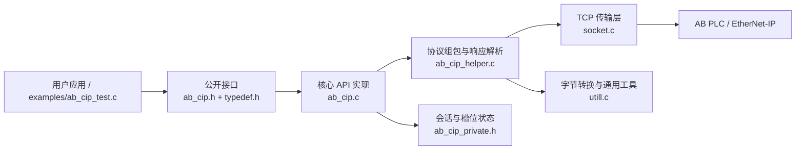
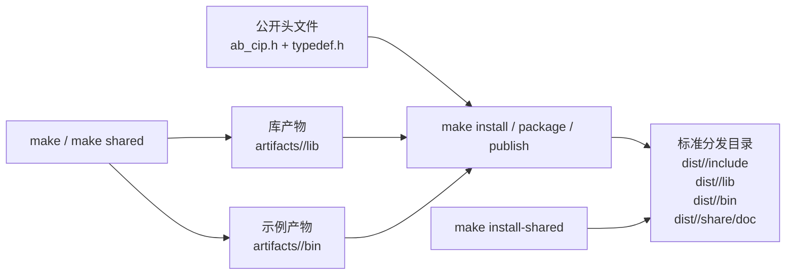

# ab_plc_cip_net

[English README](README_EN.md)

## 版权与作者信息

- License: MIT（见 [LICENSE](LICENSE)）
- GitHub: iceman
- Email: [wqliceman@gmail.com](mailto:wqliceman@gmail.com)
- Copyright (c) 2022-2026 iceman

## 项目概述

- 项目名称：ab_plc_cip_net
- 开发语言：C
- 支持系统：Windows / Linux
- 测试设备：模拟 AB-CIP

本项目实现了一个基于 CIP（EtherNet/IP）协议的罗克韦尔 AB-PLC 通讯库。使用前请先在 PLC 侧正确配置以太网模块。

## 架构概览



## 公开头文件

```c
#include "ab_cip.h"   // 公开 CIP 接口
#include "typedef.h"  // 公开类型定义
```

## 连接参数

- `port`：端口号，通常为 44818
- `plc_type`：支持 1756 ControlLogix、1756 GuardLogix、1769 CompactLogix、5069 CompactLogix、Studio 5000 Logix Emulate 等常见型号

## PLC 地址访问说明

当前库支持基于标签名的读写访问，重点覆盖常见标量类型与字符串类型，而不是完整铺开全部 CIP 功能面。

## API 参考

### 连接与断开

```c
byte get_plc_slot();
void set_plc_slot(byte slot);

bool ab_cip_connect(char* ip_addr, int port, int slot, int* fd);
bool ab_cip_disconnect(int fd);
```

### 读取数据

```c
cip_error_code_e ab_cip_read_bool(int fd, const char* address, bool* val);
cip_error_code_e ab_cip_read_short(int fd, const char* address, short* val);
cip_error_code_e ab_cip_read_ushort(int fd, const char* address, ushort* val);
cip_error_code_e ab_cip_read_int32(int fd, const char* address, int32* val);
cip_error_code_e ab_cip_read_uint32(int fd, const char* address, uint32* val);
cip_error_code_e ab_cip_read_int64(int fd, const char* address, int64* val);
cip_error_code_e ab_cip_read_uint64(int fd, const char* address, uint64* val);
cip_error_code_e ab_cip_read_float(int fd, const char* address, float* val);
cip_error_code_e ab_cip_read_double(int fd, const char* address, double* val);
cip_error_code_e ab_cip_read_string(int fd, const char* address, int* length, char** val);
```

### 写入数据

```c
cip_error_code_e ab_cip_write_bool(int fd, const char* address, bool val);
cip_error_code_e ab_cip_write_short(int fd, const char* address, short val);
cip_error_code_e ab_cip_write_ushort(int fd, const char* address, ushort val);
cip_error_code_e ab_cip_write_int32(int fd, const char* address, int32 val);
cip_error_code_e ab_cip_write_uint32(int fd, const char* address, uint32 val);
cip_error_code_e ab_cip_write_int64(int fd, const char* address, int64 val);
cip_error_code_e ab_cip_write_uint64(int fd, const char* address, uint64 val);
cip_error_code_e ab_cip_write_float(int fd, const char* address, float val);
cip_error_code_e ab_cip_write_double(int fd, const char* address, double val);
cip_error_code_e ab_cip_write_string(int fd, const char* address, int length, const char* val);
```

## 使用示例

完整示例请参考 [examples/ab_cip_test.c](examples/ab_cip_test.c)。示例程序与核心库目标已解耦，便于下游项目只链接库本体而不引入演示代码。

```c
int fd = -1;
bool ok = ab_cip_connect("127.0.0.1", 44818, 0, &fd);
if (ok && fd > 0) {
    // 在这里执行读写操作
    ab_cip_disconnect(fd);
}
```

## 构建与分发

当前仓库采用两级 Makefile 布局：

- 示例源码：[examples/ab_cip_test.c](examples/ab_cip_test.c)
- 构建配置：[config.mk](config.mk)
- 共享规则：[common.mk](common.mk)
- 库目标 Makefile：[ab_plc_cip_net/makefile](ab_plc_cip_net/makefile)
- 示例目标 Makefile：[examples/makefile](examples/makefile)

### 构建与发布流程



### 使用 Make 构建

在仓库根目录执行：

```bash
make
make clean
```

默认的 `make` 会先生成静态库，再链接示例程序。产物位于：

- `artifacts/debug/lib/libab_plc_cip_net.a`
- `artifacts/debug/bin/ab_cip_test`

### 构建选项

编辑 [config.mk](config.mk)：

- `DEBUG=true`：启用 `-g` 调试符号
- `DEBUG=false`：构建 release 模式
- `BUILD_SHARED=true`：让库目标从静态库切换为共享库输出

常用命令：

```bash
make lib
make shared
make example
make install
make package
make publish
make install-shared
make DEBUG=false
```

`make install` 默认会导出如下标准分发结构：

```text
dist/debug/
  include/
    ab_cip.h
    typedef.h
  lib/
    libab_plc_cip_net.a
  bin/
    ab_cip_test
  share/doc/ab_plc_cip_net/
    LICENSE
    README.md
    README_EN.md
```

如果需要导出到其他目录，可以覆盖 `PREFIX`：

```bash
make install PREFIX=/tmp/ab_plc_cip_net
make install-shared PREFIX=/tmp/ab_plc_cip_net-shared
```

### Windows 说明

- Makefile 构建链假定系统中可用 GNU Make，例如通过 WSL 或 MSYS2
- 如果使用 Visual Studio，请打开 [ab_plc_cip_net/ab_plc_cip_net.sln](ab_plc_cip_net/ab_plc_cip_net.sln)。当前解决方案已拆分为库工程和独立示例工程
