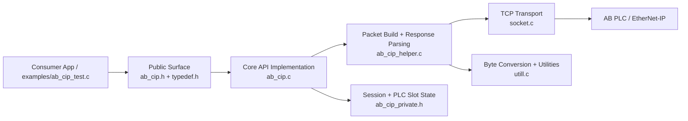
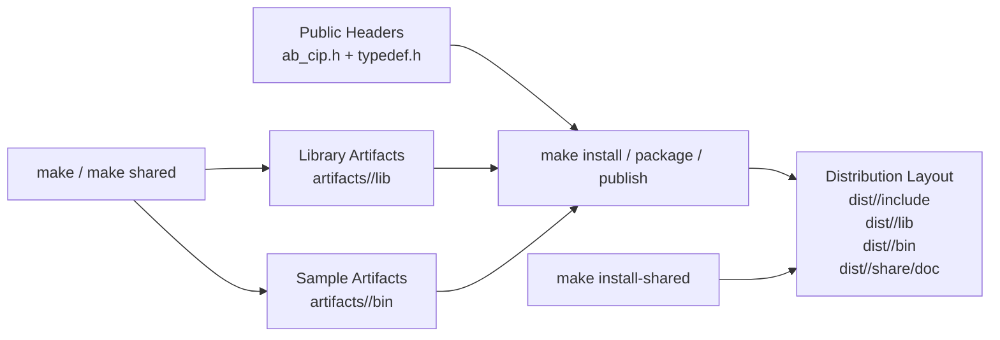

# ab_plc_cip_net

## Copyright and Author

- License: MIT (see [LICENSE](LICENSE))
- GitHub: iceman
- Email: [wqliceman@gmail.com](mailto:wqliceman@gmail.com)
- Copyright (c) 2022-2026 iceman

## Project Overview

- Project Name: ab_plc_cip_net
- Development Language: C
- Supported Operating Systems: Windows, Linux
- Test Device: Simulated AB-CIP

The current implementation provides a Rockwell AB-PLC communication library based on the CIP (EtherNet/IP) protocol. Before using it, configure the Ethernet module correctly on the PLC side.

## Architecture Overview



## Public Headers

```c
#include "ab_cip.h"   // Public CIP interfaces
#include "typedef.h"  // Public type definitions
```

## Connection Properties

- `port`: Port number, typically 44818
- `plc_type`: PLC model, compatible with 1756 ControlLogix, 1756 GuardLogix, 1769 CompactLogix, 1769 Compact GuardLogix, 1789SoftLogix, 5069 CompactLogix, 5069 Compact GuardLogix, Studio 5000 Logix Emulate, and similar devices

## PLC Address Classification

The library supports tag-based read and write operations. The current implementation focuses on common scalar and string access paths rather than the full CIP feature surface.

## API Reference

### Connecting to PLC Devices

```c
byte get_plc_slot();
void set_plc_slot(byte slot);

bool ab_cip_connect(char* ip_addr, int port, int slot, int* fd);
bool ab_cip_disconnect(int fd);
```

### Reading Data

```c
cip_error_code_e ab_cip_read_bool(int fd, const char* address, bool* val);
cip_error_code_e ab_cip_read_short(int fd, const char* address, short* val);
cip_error_code_e ab_cip_read_ushort(int fd, const char* address, ushort* val);
cip_error_code_e ab_cip_read_int32(int fd, const char* address, int32* val);
cip_error_code_e ab_cip_read_uint32(int fd, const char* address, uint32* val);
cip_error_code_e ab_cip_read_int64(int fd, const char* address, int64* val);
cip_error_code_e ab_cip_read_uint64(int fd, const char* address, uint64* val);
cip_error_code_e ab_cip_read_float(int fd, const char* address, float* val);
cip_error_code_e ab_cip_read_double(int fd, const char* address, double* val);
cip_error_code_e ab_cip_read_string(int fd, const char* address, int* length, char** val);
```

### Writing Data

```c
cip_error_code_e ab_cip_write_bool(int fd, const char* address, bool val);
cip_error_code_e ab_cip_write_short(int fd, const char* address, short val);
cip_error_code_e ab_cip_write_ushort(int fd, const char* address, ushort val);
cip_error_code_e ab_cip_write_int32(int fd, const char* address, int32 val);
cip_error_code_e ab_cip_write_uint32(int fd, const char* address, uint32 val);
cip_error_code_e ab_cip_write_int64(int fd, const char* address, int64 val);
cip_error_code_e ab_cip_write_uint64(int fd, const char* address, uint64 val);
cip_error_code_e ab_cip_write_float(int fd, const char* address, float val);
cip_error_code_e ab_cip_write_double(int fd, const char* address, double val);
cip_error_code_e ab_cip_write_string(int fd, const char* address, int length, const char* val);
```

## Usage Example

Refer to [examples/ab_cip_test.c](examples/ab_cip_test.c) for the complete sample application. The example is intentionally separate from the core library target so downstream consumers can link the library without pulling in demo code.

```c
#include "ab_cip.h"

int fd = -1;
bool ok = ab_cip_connect("127.0.0.1", 44818, 0, &fd);
if (ok && fd > 0) {
    /* perform read and write operations here */
    ab_cip_disconnect(fd);
}
```

## Build and Distribution

This repository uses a two-level Makefile layout:

- Example source: [examples/ab_cip_test.c](examples/ab_cip_test.c)
- Build config: [config.mk](config.mk)
- Shared rules: [common.mk](common.mk)
- Library makefile: [ab_plc_cip_net/makefile](ab_plc_cip_net/makefile)
- Example makefile: [examples/makefile](examples/makefile)

### Build and Publish Flow



### Linux / WSL

Run from the repository root:

```bash
make
make clean
```

The default `make` target builds the static library first and then links the example binary. Artifacts are written to:

- `artifacts/debug/lib/libab_plc_cip_net.a`
- `artifacts/debug/bin/ab_cip_test`

### Build Options

Edit [config.mk](config.mk):

- `DEBUG=true` enables `-g` debug symbols
- `DEBUG=false` builds in release mode
- `BUILD_SHARED=true` switches the library makefile from static output to shared output

Additional targets:

```bash
make lib
make shared
make example
make install
make package
make publish
make install-shared
make DEBUG=false
```

`make install` exports a standard distribution layout under `dist/<debug|release>/`:

```text
dist/debug/
  include/
    ab_cip.h
    typedef.h
  lib/
    libab_plc_cip_net.a
  bin/
    ab_cip_test
  share/doc/ab_plc_cip_net/
    LICENSE
    README.md
    README_EN.md
```

To stage the package somewhere else, override `PREFIX`:

```bash
make install PREFIX=/tmp/ab_plc_cip_net
make install-shared PREFIX=/tmp/ab_plc_cip_net-shared
```

### Windows Notes

- The Makefile flow assumes GNU Make is available, for example through WSL or MSYS2
- For Visual Studio builds, use [ab_plc_cip_net/ab_plc_cip_net.sln](ab_plc_cip_net/ab_plc_cip_net.sln), which contains a library project and a separate example application project
